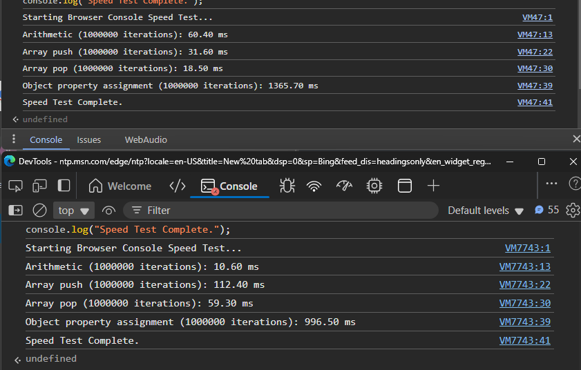

# Simple JavaScript-Based Browser Console Speed Test

JavaScript code to benchmark browser console operations.

[comment]: <> (This is a comment, it will not be included)
[//]: <> (This is also a comment.)
[//]: # ()

[//]: # (I was trying to find any repo on Github for this, But I asked github's copilot for the first time. Despite asking it to FIND, instead it created the code.)

[//]: # (Which is enough to go by for me right now.)

[//]: # (SO The code, and readme is genereated by AI/Github's own co-pilot)

## About This Project

When searching for existing repositories to measure browser ~~console~~ performance, I attempted to use GitHub Copilot. Instead of locating a suitable project, Copilot generated this code for me. For my current needs, this AI-generated solution is sufficient.

## What the Code Does

This JavaScript script runs a series of performance tests in your browser's console, measuring how long it takes to perform common operations such as arithmetic, array manipulation, and object property assignments.

## How to Use and Understand the Output

1. **Usage:**  
   - Copy the contents of `browser_speed_test.js`.
   - Paste it into your browser's developer console.
   - Run the script.

2. **Interpreting Results:**  
   - The script prints the time (in milliseconds) taken for each operation:
     - Arithmetic calculations
     - Adding values to an array (`push`)
     - Removing values from an array (`pop`)
     - Assigning properties to an object
   - Lower values indicate better performance for that operation in your browser environment.

Each result helps you understand how efficiently your browser handles basic JavaScript tasks.

## What Do the Values Mean?

- Each reported time reflects how quickly your browser processes a specific kind of JavaScript operation.
- **Lower times** indicate better performance for that operation.
- Differences in values can be caused by factors like system resources, browser optimization, how many tabs are open, or background activity.
- For most modern browsers, arithmetic and simple array operations should complete very quickly (often under 100 ms), while object property assignments take longer due to memory allocation and management.

**Range Interpretation:**
- If your results for each test are within a few tens to hundreds of milliseconds, your browser is performing normally for typical usage.
- If you notice consistently high values (hundreds or thousands of milliseconds), it may indicate heavy system load or limitations in your browser's JavaScript engine.

These benchmarks can help you compare performance between browsers, or before and after making changes to your system or browser environment.
